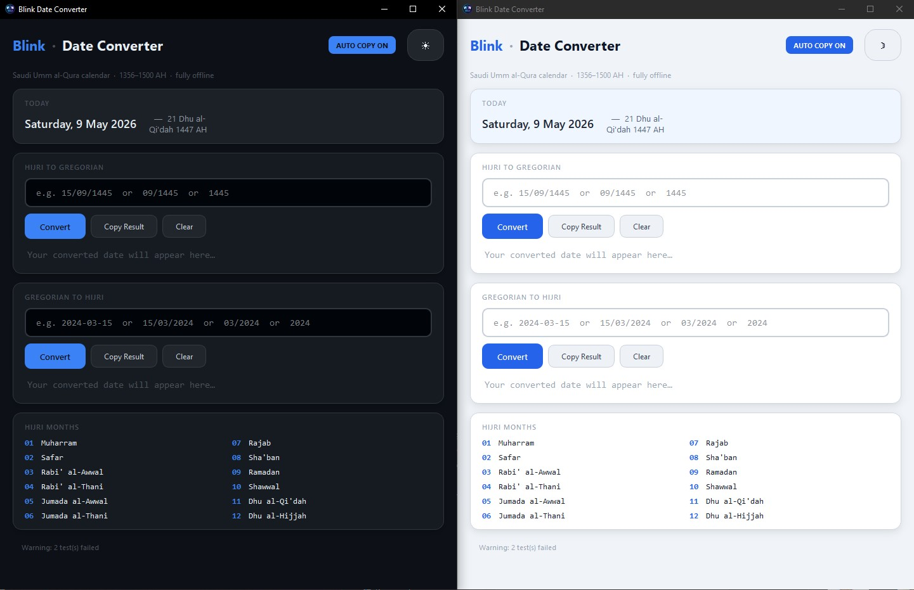

# Blink Date Converter

<p align="center">
  
</p>

<p align="center">
  A modern, lightweight desktop app for converting dates between the <strong>Saudi Umm al-Qura Hijri calendar</strong> and the <strong>Gregorian calendar</strong>.
</p>

<p align="center">
  
  
  
  
</p>

---

## Features

- **Bidirectional Conversion**
  - Hijri to Gregorian
  - Gregorian to Hijri

- **Flexible Input Formats**
  - Hijri: `1445` (year), `09/1445` (month/year), `15/09/1445` (full date)
  - Gregorian: `2024` (year), `03/2024` (month/year), `2024-03-15` or `15/03/2024` (full date)

- **Auto-Copy Toggle** — Enable or disable automatic clipboard copy
- **Today's Date Card** — Live display of today's date in both calendars
- **Hijri Months Reference** — Built-in lookup for all 12 Hijri months
- **Dark / Light Mode** — Persistent theme with modern styling
- **100% Offline** — No internet required
- **Native Qt6** — Fast, lightweight, no Electron bloat

---

## Screenshots

<p align="center">
  
</p>

---

## Download

Grab the latest release from the [Releases](../../releases) page, or [build from source](#build-from-source).

---

## Build from Source

### Prerequisites

| Tool | Version | Notes |
|------|---------|-------|
| [Qt6](https://www.qt.io/download-open-source) | 6.2+ | Select **MinGW** during install |
| MinGW-w64 | 11.x | Ships with Qt installer |
| qmake | — | Ships with Qt |

### Option 1 — Build Script (Recommended)

```bat
:: Clone the repo
git clone https://github.com/LeaDer-E/Blink-Date-Converter
cd Blink-Date-Converter

:: Build release
build.bat

:: Or rebuild from scratch
build.bat rebuild

:: Or clean all artifacts
build.bat clean
```

The executable will be at `release\BlinkDateConverter.exe`.

### Option 2 — Manual Build

```bat
:: 1. Add Qt and MinGW to PATH
set PATH=C:\Qt\6.11.0\mingw_64\bin;C:\Qt\Tools\mingw1310_64\bin;%PATH%

:: 2. Generate Makefile
qmake src\BlinkDateConverter.pro

:: 3. Build
mingw32-make -j4

:: 4. Run
release\BlinkDateConverter.exe
```

### Option 3 — Qt Creator

1. Open Qt Creator
2. **File → Open Project →** select `src\BlinkDateConverter.pro`
3. Choose your **MinGW kit**
4. **Build → Build Project**

---

## Deploy / Distribute

After building, bundle all required Qt DLLs into a portable folder:

```bat
deploy.bat
```

This creates:
- `dist\BlinkDateConverter\` — Portable folder with `.exe` + DLLs
- `dist\BlinkDateConverter.zip` — Ready-to-share ZIP archive

---

## Project Structure

```
blink-date-converter/
├── build.bat                    — One-click build (supports clean / rebuild)
├── deploy.bat                   — Bundle into portable folder + ZIP
├── README.md                    — This file
├── src/
│   ├── BlinkDateConverter.pro   — Qt project file
│   ├── main.cpp                 — Entry point
│   ├── mainwindow.h             — Main window header
│   ├── mainwindow.cpp           — UI + conversion logic
│   ├── conversion.h             — Umm al-Qura engine header
│   ├── conversion.cpp           — Umm al-Qura engine
│   └── assets/
│       ├── app.ico              — Application icon
        ├── BlinkDateConverter.png
        └── Screenshot.jpg
├── build/                       — Build artifacts (generated)
├── release/                     — Executable output (generated)
└── dist/                        — Deployment output (generated)
```

---

## Customization

### Change the Icon

Replace `src/assets/app.ico` with your own 256x256 `.ico` file, then run:

```bat
build.bat rebuild
```

### Calendar Accuracy

| Query Type | Verified Years (1440–1447 AH) | Other Years |
|------------|-------------------------------|-------------|
| Year range | **Exact** | ±1–2 days |
| Month range | **Exact** | ±1–2 days |
| Exact day | **Exact** | ±1–2 days |

Supported range: **1356 – 1500 AH** (approx. 1937 – 2077 CE)

---

## Usage

### Input Formats

| Direction | Format | Example |
|-----------|--------|---------|
| Hijri → Gregorian | Year | `1445` |
| | Month/Year | `09/1445` |
| | Full date | `15/09/1445` |
| Gregorian → Hijri | Year | `2024` |
| | Month/Year | `03/2024` |
| | Full date | `2024-03-15` or `15/03/2024` |

### Shortcuts

| Key | Action |
|-----|--------|
| `Enter` | Convert |
| `Tab` | Next field |

---

## Contributing

Contributions are welcome!

1. Fork the repo
2. Create a branch: `git checkout -b feature/my-feature`
3. Commit your changes: `git commit -am 'Add my feature'`
4. Push: `git push origin feature/my-feature`
5. Open a [Pull Request](../../pulls)

Found a bug? Open an [Issue](../../issues).

---

## License

Licensed under the [MIT License](LICENSE).

The Umm al-Qura conversion engine is based on publicly documented astronomical calculations and verified Saudi government announcements.

---

## Acknowledgements

- [Qt Framework](https://www.qt.io/) by The Qt Company
- Umm al-Qura calendar data from official Saudi announcements

---

<p align="center">
  Made with ❤️ using Qt6
</p>
